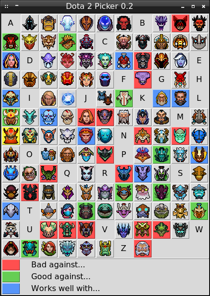
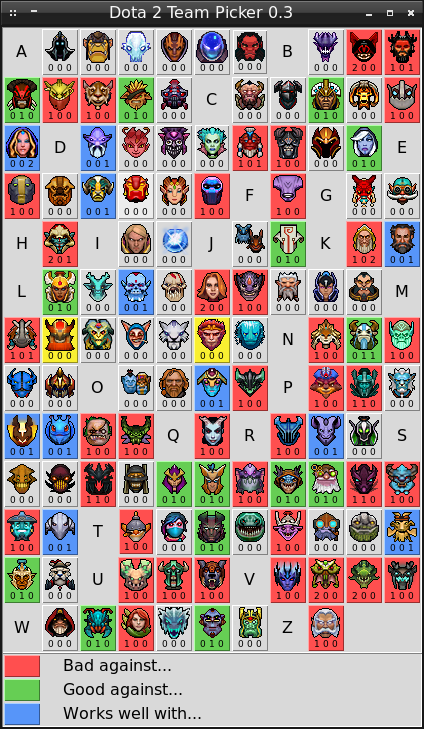
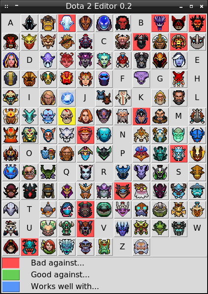

# Dota 2 Counter Picker 0.5 version

Dota 2 Counter Picker is a utility for choosing the best combinations of heroes and counter picks.

A current development state is available in the [`CHANGELOG.md`](CHANGELOG.md) file.

## Installation

You need two Python 2.7, Tkinter and pillow modules to launch the Dota 2 Counter Picker.

### Windows

These are steps to install Python 3 and required modules on Windows:

1. Download the archive with Dota 2 Counter Picker and extract it:<br/>
https://github.com/ellysh/dota2-counter-picker/archive/master.zip

2. Download the Python 3 distribution:<br/>
https://www.python.org/downloads/release/python-373/

3. Install Python 3.

4. Install the pip utility with the following command in the command line:<br/>
`python get-pip.py`

5. Install the `pillow` module:<br/>
`pip install pillow`

### Ubuntu

These are steps to install Python 3 and required modules on Linux:

1. Download the archive with Dota 2 Counter Picker and extract it:<br/>
https://github.com/ellysh/dota2-counter-picker/archive/master.zip

2. Install the Python 3:<br/>
`sudo apt-get install python3`

3. Install the Tkinter module:<br/>
`sudo apt-get install python3-tk`

4. Install the `pillow` module:<br/>
`sudo apt-get install python3-pil.imagetk`

## Usage

### Picker

The `picker.py` script shows you which heroes are bad or good against the chosen one. Also, the script shows which heroes can be combined well.



Start the `picker.py` script and click on the hero icon. The yellow color will highlight it. The red color highlights all heroes who can easily beat the selected one. We can say that the selected hero is "bad against" them. The green color means that the chosen hero is "good against" the selected ones. The blue color shows heroes which can be combined effectively with the selected hero in one team. It means that he "works well with" them.

There are three buttons with red, green and blue color at the bottom of the window. You can press each button filtering the highlighted heroes. If you press the red button, only heroes which are strong against the chosen one will be highlighted. The green and blue buttons work the same for "good against..." and "works well with..." heroes.

### Team Picker

The `team-picker.py` script works similarly as `picker.py`. It shows you "bad against", "good against" and "works well with" relations between heroes.



The `team-picker.py` script allows you to pick several heroes at the same time. Then it shows relations of all picked heroes. Meaning of the colors, which highlight heroes, are the same as for the `picker.py` script. You can filter highlights with the red, green and blue buttons at the bottom of the window.

There are three digits under each hero icon which estimate him. These are meaning of these digits:

1. How many of the picked heroes (they are highlighted yellow) are bad against the hero on the corresponding icon?
2. How many of the picked heroes are good against this one?
3. How many of the picked heroes are works well with this one?

Let's consider an example with the window on the screenshot above. The enemy team has picked two heroes: Mars and Monkey King. Both of them are bad against Batrider. Thus, Batrider gets scores "2 0 0". If you pick Batrider in the game, it will be a good choice in this case.

At the same time, Monkey King is bad against Spectre but Mars is good against her. Thus, Spectre gets scores "1 1 0". She is still highlighted red because her bad and good scores are equal. She will get the green color in case of "1 2 0" scores for example. If you pick Spectre against Mars and Monkey King, probably you will have a tough game.

You can cancel the current selection of heroes by the *Esc* button.

### Editor

The initial version of the database with heroes was prepared based on the [Dota 2 Wiki](https://dota2.gamepedia.com/Category:Counters). The `editor.py` script allows you to edit this database.



Start the `editor.py` script. It looks like the `picker.py` script. Meaning of all colors is the same.

These are steps to remove the hero from the "bad against..." relations:

1. Choose the Lifestealer hero for example. The yellow color will highlight him.

2. Press the red button at the bottom of the window. You will see only heroes with "bad against..." relations for Lifestealer. Now you are in the editing mode.

3. Press the Monkey King hero. You will see that the color of his button becomes grey. This hero was removed from the "bad against..." relations for Lifestealer.

4. Finish the editing mode by pressing the red button again. Now you see all three relations of Lifestealer. Monkey King hero is not counter pick for Lifestealer anymore.

You can follow the same algorithm for adding a hero to relations. Also, you should follow the same steps for adding/removing a hero to the "good against..." and "works well with..." relations.

The `picker.py`, `team-picker.py`, `checker.py` and `editor.py` scripts use the same database. It means that you will see all your changes in all these scripts. The database with heroes is stored in the `database/Database.pkl` file.

### Checker

After editing the database, you want to check if it is consistent. The possible issue is you specify a hero A as "bad against..." the hero B but you forget to specify vice versa relation. This relation means that the hero B should be "good against..." the hero A. The `checker.py` script checks for such kind of mistakes in the database. If you launch the script in the console (or Command Prompt on Windows), you see the report about such mistakes.

This is an example output of the script:
```
Tiny is "good against" Naga Siren but Naga Siren is not "bad against" Tiny
```
By default, the script does not fix these issues but it has two option to do it:

1. Use the `-a` command line option to add missing heroes to the required list:
```
checker.py -a
```
Let's see on our example output above. After the command with `-a`, Tiny will be added to the Naga Siren's "bad against" list.

2. Use the `-d` command line option to remove extra heroes from the required list:
```
checker.py -d
```
After the command with `-d`, Naga Siren will be removed from the Tiny's "good against" list.

Another possible issue is conflicting relations. Let's assume that hero A is good against hero B according to the database. At the same time, the hero B is good again A by accidental mistake.

This is a possible output of these mistakes:
```
Naga Siren has Huskar in both "bad against" and "good against" lists
Huskar has Naga Siren in both "bad against" and "good against" lists
```
It means that Naga Siren and Huskar has conflicting relations and counters each other. You should fix it by the `editor.py` script in three steps:

1. Remove Naga Siren from the "good against..." list of Huskar.

2. Remove Huskar from the "bad against..." list of Naga Siren.

3. Launch the `checker.py` script again.

Now the report about conflicts should be empty.

The `checker.py` script works with the database in the Pickle format (the `database/Database.pkl` file).

### Import and Export

The `picker.py`, `team-picker.py`, `checker.py` and `editor.py` scripts use the database in the Pickle format (the `database/Database.pkl` file). This is a binary format, which is not convenient for reviewing in a text editor and comparing with other database files. 

The `pkl2csv.py` script allows you to convert the database from the Pickle format to the CSV. If you launch the script, you get the `database/Database.csv` file. You can open this file in any text editor or MS/Libre Office application.

When you are done with reviewing the database in the CSV format, you should launch the `csv2pkl.py` script. It converts the database back to the Pickle format and stores it in the `database/Database.pkl` file.

## Update

These are the recommended steps for updating Dota 2 Counter Picker:

1. Download the archive with the latest version of the scripts and extract it to the new folder:<br/>
https://github.com/ellysh/dota2-counter-picker/archive/master.zip

2. Go to the old folder of the picker and export your database to the CSV format (with the `pkl2csv.py` script).

3. Copy both `database/Database.pkl` and `database/Database.csv` files to the folder with the new version of the picker (into the `database` sub-folder).

4. Remove the folder with the old version of the scripts.

## Contacts

If you have any suggestions, bug reports or questions about usage of Dota 2 Counter Picker, please contact me via email petrsum@gmail.com.

## License

This project is distributed under the GPL v3.0 license
